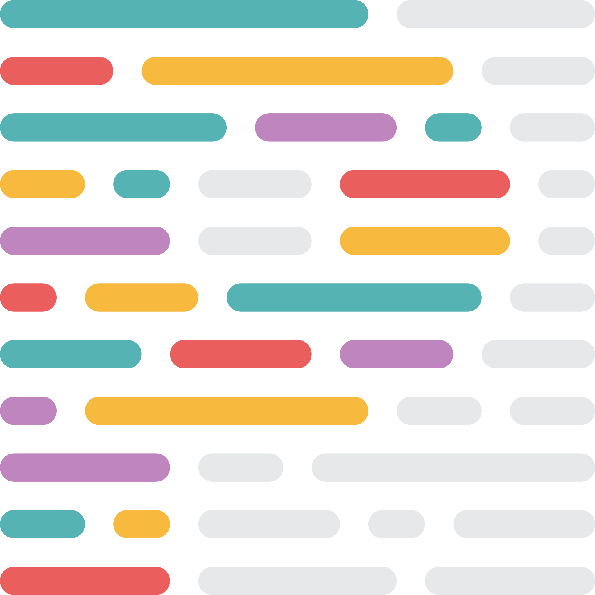

### Hi 👋, I'm Ravoan!

-   🔭 I’m currently working as software engineering

-   🌱 I’m currently learning everthing 😄

-   ⚡ Fun fact: I keep night shift swithed on at all times

#### Languages and Tools

<div align="start">
  <picture>
    <source media="(prefers-color-scheme: dark)" srcset="./assets/icons/HTML.svg">
    <source media="(prefers-color-scheme: light)" srcset="./assets/icons/HTML.svg">
    
  </picture>
  &nbsp;
  <picture>
    <source media="(prefers-color-scheme: dark)" srcset="./assets/icons/CSS.svg">
    <source media="(prefers-color-scheme: light)" srcset="./assets/icons/CSS.svg">
    
  </picture>
  &nbsp;
  <picture>
    <source media="(prefers-color-scheme: dark)" srcset="./assets/icons/Sass.svg">
    <source media="(prefers-color-scheme: light)" srcset="./assets/icons/Sass.svg">
    
  </picture>
  &nbsp;
  <picture>
    <source media="(prefers-color-scheme: dark)" srcset="./assets/icons/JavaScript.svg">
    <source media="(prefers-color-scheme: light)" srcset="./assets/icons/JavaScript.svg">
    
  </picture>
  &nbsp;
  <picture>
    <source media="(prefers-color-scheme: dark)" srcset="./assets/icons/TypeScript.svg">
    <source media="(prefers-color-scheme: light)" srcset="./assets/icons/TypeScript.svg">
    
  </picture>
  &nbsp;
  <picture>
    <source media="(prefers-color-scheme: dark)" srcset="./assets/icons/Bootstrap.svg">
    <source media="(prefers-color-scheme: light)" srcset="./assets/icons/Bootstrap.svg">
    
  </picture>
  &nbsp;
  <picture>
    <source media="(prefers-color-scheme: dark)" srcset="./assets/icons/TailwindCSS-Dark.svg">
    <source media="(prefers-color-scheme: light)" srcset="./assets/icons/TailwindCSS-Light.svg">
    
  </picture>
</div>

<div align="start">
  <picture>
    <source media="(prefers-color-scheme: dark)" srcset="./assets/icons/Webpack-Dark.svg">
    <source media="(prefers-color-scheme: light)" srcset="./assets/icons/Webpack-Light.svg">
    
  </picture>
  &nbsp;
  <picture>
    <source media="(prefers-color-scheme: dark)" srcset="./assets/icons/Vite-Dark.svg">
    <source media="(prefers-color-scheme: light)" srcset="./assets/icons/Vite-Light.svg">
    
  </picture>
  &nbsp;
  <picture>
    <source media="(prefers-color-scheme: dark)" srcset="./assets/icons/VueJS-Dark.svg">
    <source media="(prefers-color-scheme: light)" srcset="./assets/icons/VueJS-Light.svg">
    
  </picture>
  &nbsp;
  <picture>
    <source media="(prefers-color-scheme: dark)" srcset="./assets/icons/React-Dark.svg">
    <source media="(prefers-color-scheme: light)" srcset="./assets/icons/React-Light.svg">
    
  </picture>
  &nbsp;
  <picture>
    <source media="(prefers-color-scheme: dark)" srcset="./assets/icons/NestJS-Dark.svg">
    <source media="(prefers-color-scheme: light)" srcset="./assets/icons/NestJS-Light.svg">
    
  </picture>
  &nbsp;
  <picture>
    <source media="(prefers-color-scheme: dark)" srcset="./assets/icons/GraphQL-Dark.svg">
    <source media="(prefers-color-scheme: light)" srcset="./assets/icons/GraphQL-Light.svg">
    
  </picture>
  &nbsp;
  <picture>
    <source media="(prefers-color-scheme: dark)" srcset="./assets/icons/Redux.svg">
    <source media="(prefers-color-scheme: light)" srcset="./assets/icons/Redux.svg">
    
  </picture>
  &nbsp;
  <picture>
    <source media="(prefers-color-scheme: dark)" srcset="./assets/icons/ESLint.svg">
    <source media="(prefers-color-scheme: light)" srcset="./assets/icons/ESLint.svg">
    
  </picture>
  &nbsp;
  <picture>
    <source media="(prefers-color-scheme: dark)" srcset="./assets/icons/Prettier.svg">
    <source media="(prefers-color-scheme: light)" srcset="./assets/icons/Prettier.svg">
    
  </picture>
</div>

<div align="start">
  <picture>
    <source media="(prefers-color-scheme: dark)" srcset="./assets/icons/PHP-Dark.svg">
    <source media="(prefers-color-scheme: light)" srcset="./assets/icons/PHP-Light.svg">
    
  </picture>
  &nbsp;
  <picture>
    <source media="(prefers-color-scheme: dark)" srcset="./assets/icons/Laravel-Dark.svg">
    <source media="(prefers-color-scheme: light)" srcset="./assets/icons/Laravel-Light.svg">
    
  </picture>
  &nbsp;
  <picture>
    <source media="(prefers-color-scheme: dark)" srcset="./assets/icons/MySQL-Dark.svg">
    <source media="(prefers-color-scheme: light)" srcset="./assets/icons/MySQL-Light.svg">
    
  </picture>
  &nbsp;
  <picture>
    <source media="(prefers-color-scheme: dark)" srcset="./assets/icons/Redis-Dark.svg">
    <source media="(prefers-color-scheme: light)" srcset="./assets/icons/Redis-Light.svg">
    
  </picture>
  &nbsp;
  <picture>
    <source media="(prefers-color-scheme: dark)" srcset="./assets/icons/Docker.svg">
    <source media="(prefers-color-scheme: light)" srcset="./assets/icons/Docker.svg">
    
  </picture>
  &nbsp;
  <picture>
    <source media="(prefers-color-scheme: dark)" srcset="./assets/icons/Nginx.svg">
    <source media="(prefers-color-scheme: light)" srcset="./assets/icons/Nginx.svg">
    
  </picture>
  &nbsp;
  <picture>
    <source media="(prefers-color-scheme: dark)" srcset="./assets/icons/Git.svg">
    <source media="(prefers-color-scheme: light)" srcset="./assets/icons/Git.svg">
    
  </picture>
</div>

<div align="start">
  <picture>
    <source media="(prefers-color-scheme: dark)" srcset="./assets/icons/AdobeXD.svg">
    <source media="(prefers-color-scheme: light)" srcset="./assets/icons/AdobeXD.svg">
    
  </picture>
  &nbsp;
  <picture>
    <source media="(prefers-color-scheme: dark)" srcset="./assets/icons/Photoshop.svg">
    <source media="(prefers-color-scheme: light)" srcset="./assets/icons/Photoshop.svg">
    
  </picture>
  &nbsp;
  <picture>
    <source media="(prefers-color-scheme: dark)" srcset="./assets/icons/AfterEffects.svg">
    <source media="(prefers-color-scheme: light)" srcset="./assets/icons/AfterEffects.svg">
    
  </picture>
  &nbsp;
  <picture>
    <source media="(prefers-color-scheme: dark)" srcset="./assets/icons/UnrealEngine.svg">
    <source media="(prefers-color-scheme: light)" srcset="./assets/icons/UnrealEngine.svg">
    
  </picture>
</div>

---

<!--START_SECTION:waka-->

```text
From: 19 February 2023 - To: 26 February 2023

Vue.js                     14 hrs 12 mins  ████████████▓░░░░░░░░░░░░   50.45 %
PHP                        3 hrs 4 mins    ██▓░░░░░░░░░░░░░░░░░░░░░░   10.95 %
JavaScript                 3 hrs           ██▓░░░░░░░░░░░░░░░░░░░░░░   10.65 %
TypeScript                 2 hrs 51 mins   ██▓░░░░░░░░░░░░░░░░░░░░░░   10.16 %
SCSS                       1 hr 26 mins    █▒░░░░░░░░░░░░░░░░░░░░░░░   05.09 %
Blade Template             1 hr 21 mins    █▒░░░░░░░░░░░░░░░░░░░░░░░   04.79 %
```

<!--END_SECTION:waka-->

